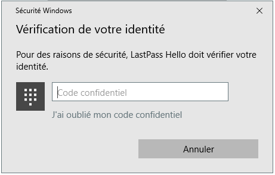
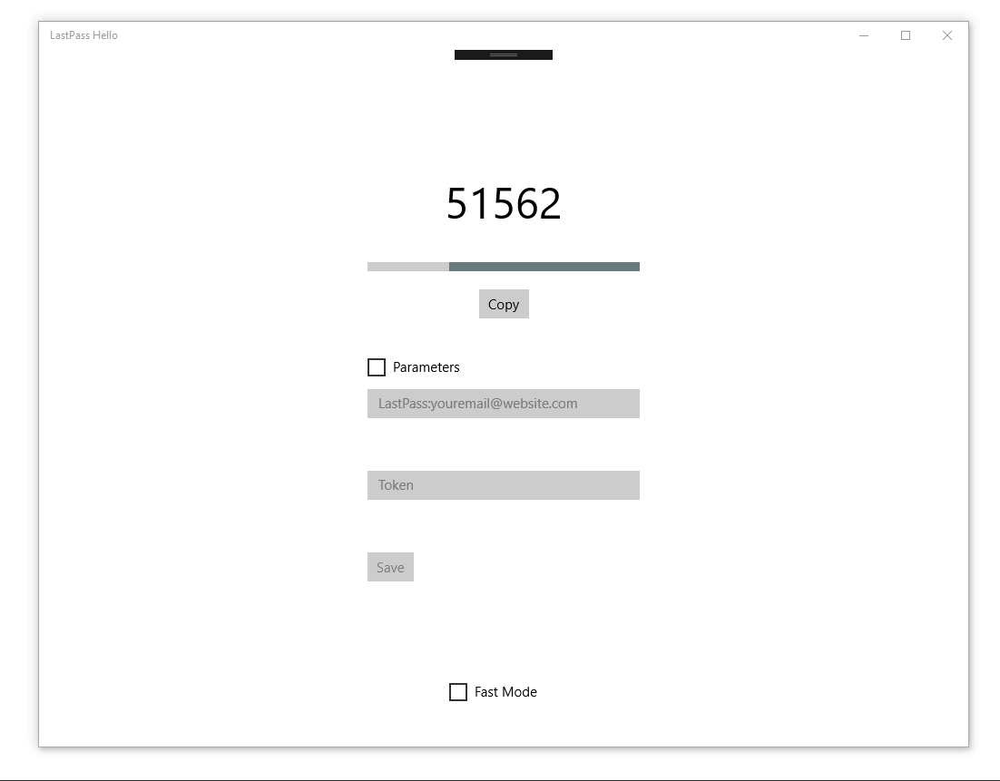
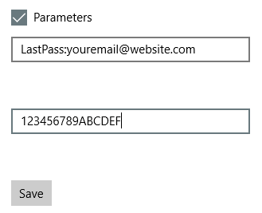

# LastPass-Hello
Unofficial Windows Hello connect application for LastPass

## Caution: this application is totaly unofficial and the security is not guaranteed by its authors!

## Screenshots

Login with pin

## How to install?
~~Actually, you can install it only by compiling it with Visual Studio 2017~~

**An application package is now available!**

To install:
- Download the last package LastPass Hello vx.x.x.zip [here](https://github.com/EmerickH/LastPass-Hello/releases)
- Unzip it
- Right click on Add-AppDevPackage.ps1
- Execute with PowerShell
- Wait for install
- Press Enter when asked and accept all certificates
- LastPass Hello is now in your app list

If you want to manualy compile LastPass Hello:
- Download the solution and open it with Visual Studio
- Open Package.appxmanifest in the solution explorer
- Go to Packages tab
- Click on Choose a certificate (or something similar)
- Configure certificate > Create a test certificate
- Enter your name and a password
- OK > OK
- Start projet (Local Computer with the green arrow on top)

## How to use?
When you open LastPass Hello, the application ask you to enter you PIN code or to authentificate with Windows Hello.
If you're correctly authentificated, a Google Authentificator is shown.
You can click on Show to edit parameters and link with yout LastPass Account:

Username = *LastPass:youremail@website.com*

Token = *Google Authentificator key*

## About
This project has been created by Emerick Herve.

It uses Google Authenticator TOTP C# : https://googleauthcsharp.codeplex.com/
